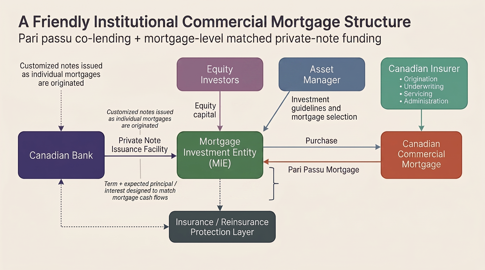
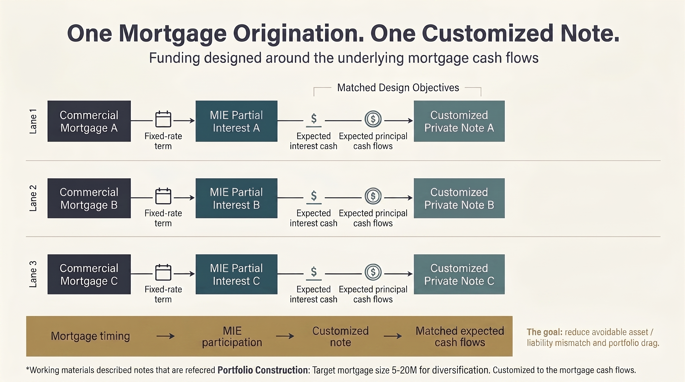
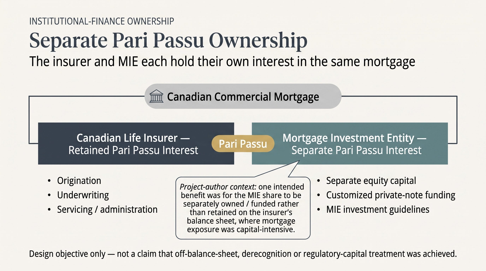
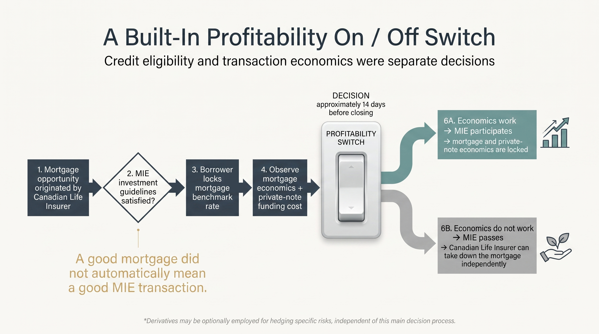
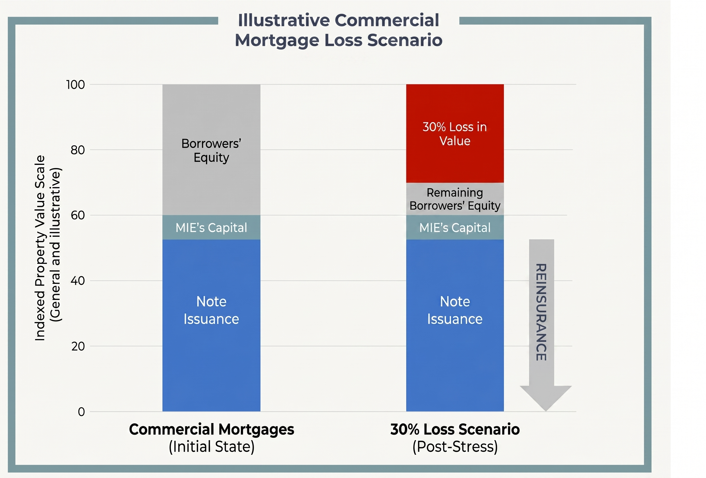

# A Friendly Institutional Commercial Mortgage Vehicle

### A portfolio case study in pari passu co-lending, mortgage-level matched funding and insurance / reinsurance

## TL;DR

I worked on a proposed **Mortgage Investment Entity (MIE)** designed to invest alongside an established Canadian life insurer in partial interests in Canadian commercial mortgages.

The Canadian life insurer would continue to originate, underwrite, service and administer the mortgages. The MIE would take a **pari passu** share of eligible loans under agreed investment guidelines.

A few features made the structure especially interesting:

- **One mortgage origination. One customized private note.** An Immediately Recognizable Canadian D-SIB contemplated an approximately **C$300 million Private Note Issuance Facility (PNIF)**. Notes could be issued as individual mortgages were originated, with fixed terms and expected principal-and-interest cash flows designed to match the underlying mortgage cash flows.
- **Pari passu co-lending.** The MIE would own a partial interest alongside the Canadian life insurer rather than replacing the insurer's origination and servicing platform.
- **A profitability on/off switch.** Near closing, the MIE could compare the mortgage economics with its matched funding cost and participate only when the transaction still worked. If it passed, the insurer could still take down the mortgage independently.
- **Insurance / reinsurance protection.** The working materials contemplated protection against mortgage payment failure. Different drafts showed different implementation paths, including a simplified reinsurance concept and a more detailed structure involving a separate mortgage insurer that would itself seek reinsurance.
- **Conservative underwriting.** Working materials contemplated first-priority commercial mortgages, maximum 60% LTV, strong DSCR requirements, third-party appraisals, diversification limits and institutional underwriting.

**Project-author context:** one intended benefit was for the MIE's share of the mortgages to be separately owned and funded rather than retained on the Canadian insurer's balance sheet, where commercial-mortgage exposure was capital-intensive. This is presented as a **design objective**, not as a claim that any particular off-balance-sheet, derecognition or regulatory-capital treatment was ultimately achieved.

> **Portfolio note:** This repository reconstructs and sanitizes a proposed transaction. Counterparty names, dates and confidential commercial terms are intentionally removed. It does not claim the transaction closed or that any contemplated accounting, regulatory, tax, insurance or reinsurance treatment was finalized.

---

## The idea

The interesting part was not creating another mortgage platform.

The Canadian life insurer already had institutional origination, underwriting, servicing and administration capabilities. The proposed MIE was designed to sit **alongside** that platform as a separate co-lender.

That created a simple organizing idea:

> **Keep the existing institutional mortgage platform intact. Add a separately funded pari passu investor beside it.**

The structure then had to solve several practical questions at the same time:

- Which mortgages could the MIE own?
- How would the MIE fund each participation?
- How closely could funding cash flows match mortgage cash flows?
- What happens when mortgage and funding economics move before closing?
- How should credit protection fit into the structure?
- How should accounting, tax and regulatory treatment be tested before execution?

---

## Transaction architecture

The working materials contemplated several institutional roles:

| Participant | Proposed role |
|---|---|
| **Immediately Recognizable Canadian Life Insurer** | Origination, underwriting, servicing, administration and retained pari passu mortgage interest |
| **Affiliated Institutional Asset Manager** | Mortgage selection / investment management within MIE investment guidelines |
| **Mortgage Investment Entity (MIE)** | Separate partial mortgage interests, equity capital, funding obligations and residual economics |
| **Immediately Recognizable Canadian D-SIB** | Approximately C$300M customized Private Note Issuance Facility |
| **Insurance / Reinsurance Providers** | Proposed protection against mortgage payment failure; exact contracting chain evolved across drafts |
| **Equity Investors** | MIE capital / residual risk capital |

*Illustrative overview of the proposed commercial-mortgage structure, including the MIE, equity capital, institutional roles, customized note funding and insurance / reinsurance protection.*

For the detailed mechanics, see [Transaction Structure](structure.md).

---

## One mortgage origination. One customized note.

This was one of the clearest pieces of the design.

The private-note facility was not simply a generic pool-level borrowing raised in advance. The working materials contemplated **notes issued for each mortgage origination**, with the ability to:

- provide a fixed rate over the mortgage term;
- match expected principal and interest payments to the mortgage cash flows;
- accommodate the uncertain timing of mortgage originations; and
- avoid funding the entire facility before the assets existed.

*Each mortgage origination could be paired with a customized private note designed around the term and expected principal-and-interest cash flows of that specific mortgage.*

For the detailed economics, see [Economics](economics.md).

---

## Pari passu co-lending

The detailed working materials contemplated the MIE investing in **partial interests** in commercial mortgages with the Canadian life insurer.

Those interests would be **pari passu**.

This was a co-lending structure: the MIE and insurer could own interests in the same mortgage under a shared interlender framework.

The insurer would continue to provide the origination, underwriting, servicing and administration capabilities. The MIE would apply its own investment guidelines to the portion offered to it.

*Illustrative framing of the ownership model: the insurer and the MIE each hold their own pari passu interest in the same mortgage, while serving different roles in the structure.*

For more detail, see [Insurer Balance-Sheet Context](insurer-balance-sheet-context.md).

---

## The profitability on/off switch

Mortgage timing created a second design problem.

The borrower could sign an enforceable commitment at an agreed spread over a benchmark and lock the benchmark later. The final mortgage rate therefore was not necessarily known when the commitment was first signed.

The MIE's economics also depended on the matched private-note funding cost.

The proposed solution was a decision point roughly **14 days before closing**.

If the mortgage met the MIE's investment guidelines and the economics still worked, the MIE could participate and lock the mortgage and private-note economics.

If the economics did not work, the MIE could pass.

The Canadian life insurer could still take down the mortgage independently.

*Credit eligibility and transaction economics were separate decisions. A good mortgage did not automatically mean a good MIE transaction.*

For more detail, see [Economics](economics.md).

---

## Insurance / reinsurance: a proposed protection layer

The structure also explored an additional layer of protection against **mortgage payment failure**.

The exact implementation was still being developed. One version connected reinsurance more directly to the MIE and funding structure, while a more detailed version contemplated a **separate mortgage insurer** providing protection to the MIE and then obtaining reinsurance for part of that exposure.

The common idea was straightforward:

- provide additional protection against mortgage payment failure;
- create premium economics for the protection provider;
- potentially diversify the reinsurer's existing book, given the different risk characteristics of conservatively underwritten Canadian commercial mortgages; and
- add another independently priced layer of risk transfer to the overall structure.

The important point was not a particular contracting chain. It was the idea that **mortgage credit protection could potentially be separated, priced and allocated to another risk-bearing institution**.

For a deeper look at the concept and its open questions, see [Insurance / Reinsurance and Credit-Risk Transfer](reinsurance-credit-risk-transfer.md).

---

## Conservative mortgage underwriting

The working materials evolved, so not every draft used identical thresholds. The common direction was conservative.

Documented elements included:

- first-priority Canadian commercial mortgages;
- maximum **60% LTV**;
- institutional credit review;
- third-party appraisal;
- environmental and building-condition review;
- property insurance;
- yield-maintenance provisions;
- geographic and property-type diversification; and
- pari passu co-investment with the insurer.

Some presentation materials used a minimum **1.4x DSCR** and contemplated 5- or 10-year fixed-rate mortgages. A more detailed investment-guideline draft used **1.5x DSCR** and terms of five years or less.

The repository preserves those differences rather than inventing a final term sheet.

*Illustrative loss scenario showing the borrower-equity cushion, MIE capital and note funding within a conservative commercial-mortgage structure.*

For the detailed underwriting framework, see [Underwriting Framework](underwriting-framework.md).

---

## A separate source of capital alongside the insurer

An important feature of the structure was that the MIE would own its **own partial, pari passu interest** in participating mortgages.

The Canadian life insurer would continue to originate, underwrite, service and administer the mortgages, while the MIE would separately fund and own its participation.

**Project-author context:** one intended benefit was for the MIE's share of the mortgage exposure to be separately owned and funded rather than remaining on the insurer's balance sheet, where commercial-mortgage exposure was capital-intensive.

That created an institutional model in which:

- the insurer could continue using its established mortgage capabilities;
- the insurer and MIE could remain economically aligned through pari passu co-investment;
- the MIE could bring a separate pool of equity and matched private-note financing to its share of the mortgage; and
- each institution would own its respective interest directly.

The precise accounting and regulatory consequences would depend on the final agreements and applicable rules. The working materials did not establish a final conclusion on consolidation, derecognition, off-balance-sheet treatment or regulatory-capital relief for the Canadian insurer.

For more detail, see [Insurer Balance-Sheet Context](insurer-balance-sheet-context.md) and [Accounting and Capital Treatment](accounting-and-capital-treatment.md).

---

## How the pieces could work for each participant

| Participant | Supported potential benefit / role |
|---|---|
| **Canadian Life Insurer** | Continues origination, underwriting, servicing and administration; retains a pari passu interest; working economics contemplated underwriting / investment-management fees; MIE separately owns and funds its share |
| **MIE / Equity Investors** | Access to institutional commercial-mortgage participations and the residual economics after funding, fees, protection, credit losses, taxes and operating costs |
| **Canadian D-SIB** | Provides customized private-note funding aligned to mortgage cash flows; protection against payment failure was contemplated in the structure |
| **Insurance / Reinsurance Providers** | Premium income; working materials identified possible diversification / covariance benefits |
| **Borrower** | In the worked example, financing could still proceed with the Canadian life insurer if the MIE chose not to participate |

The working materials explicitly recognized that profitability needed to exist for all participants for the transaction to move forward.

---

## What I worked on

This case demonstrates work across:

- transaction and counterparty mapping;
- commercial-mortgage investment guidelines;
- private-note financing mechanics;
- asset / liability cash-flow timing;
- profitability and rate-lock mechanics;
- insurance / reinsurance structure development;
- accounting, tax and regulatory questions;
- investment allocation and governance; and
- sequencing the work required to move from concept toward execution.

What I still like about the structure is the systems thinking behind it: **make several institutional capabilities fit together without asking any one party to rebuild what it already did well.**

---

## Repository map

- [`structure.md`](structure.md) — participants, pari passu co-lending and transaction sequence
- [`economics.md`](economics.md) — mortgage-level matched notes and the profitability switch
- [`reinsurance-credit-risk-transfer.md`](reinsurance-credit-risk-transfer.md) — what the working materials contemplated for protection
- [`insurer-balance-sheet-context.md`](insurer-balance-sheet-context.md) — the author-clarified balance-sheet design objective and its limits
- [`accounting-and-capital-treatment.md`](accounting-and-capital-treatment.md) — documented accounting work plus open analytical questions
- [`underwriting-framework.md`](underwriting-framework.md) — mortgage eligibility and risk controls
- [`risk-framework.md`](risk-framework.md) — system-level risks
- [`execution-plan.md`](execution-plan.md) — implementation sequence
- [`SOURCE_GROUNDING.md`](SOURCE_GROUNDING.md) — documented facts, author clarification and claims deliberately not made
- [`ABOUT_THIS_CASE.md`](ABOUT_THIS_CASE.md) — public naming and evidence discipline
